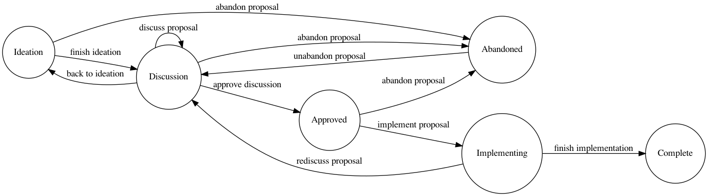

# RFCs

This repository houses RFCs.

## Motivation

Why have an RFC policy for your org? Read more about Oxide Computer's Process [here](https://oxide.computer/blog/rfd-1-requests-for-discussion) and how Uber used RFCs in their process [here](https://blog.pragmaticengineer.com/scaling-engineering-teams-via-writing-things-down-rfcs/).

## State of an RFC

An RFC may be in the following states:

- Ideation
- Discussion
- Approved
- Implementing
- Abandoned
- Complete

### Ideation

The `Ideation` state is for the original author(s) to iterate on their RFC. 

When ready for comments, the author(s) may move their RFC to `Discussion`.

If the authors feel their proposal should be abandoned, they may move their RFC to `Abandoned`. 

### Discussion

The `Discussion` state is for people other than the original author(s) to review and leave comments on the RFC.

Once discussion is finalized, and the idea is ready to move forward, the author(s) may move their RFC to `Approved`.

If the author(s) feel their RFC should be abandoned, they may move their RFC to `Abandoned`.

### Approved

The `Approved` state is where RFCs wait before being implemented.

Once a team has decided to implement the RFC, that team may move the RFC to `Implementing`.

If the author(s) feel their RFC should be abandoned, they may move their RFC to `Abandoned`.

### Implementing

The `Implementing` state is where RFCs are implemented. 

If the team in charge of implementing the RFC completes implementation of the RFC, that team may move the RFC to `Complete`.

If the team in charge of implementing the RFC decides that the RFC requires more discussion, they may move the RFC back to the `Discussion` state.

### Abandoned

The `Abandoned` state is where RFCs are left if the author(s) choose not to move forward with the ideas outlined in the RFC.

An `Abandoned` proposal may be unabandoned, where it may be moved back to the `Discussion` state.

### Complete

The `Complete` state is where finished RFCs rest.

There are no transitions from the `Complete` state.

### Diagram

## Dependencies

You'll need `pandoc` for this repository.

On Mac OS X, you can install it with `brew install pandoc`.

On Windows, you can install it with `choco install pandoc`.

On Linux Distributions, check your package manager:

On Debian/Ubuntu, you can install it with `apt-get install pandoc`.

If you'd like to regenerate the state diagram, you'll require `graphviz`.

On Mac OS X, you can install it with `brew install graphviz`.

On Windows, you can install it with `choco install graphviz`.

On Linux Distributions, check your package manager:

On Debian/Ubuntu, you can install it with `apt-get install graphviz`. 

## Scripts

To create a new RFC, run `bin/new`. This will create a new folder under `rfcs` with the left padded RFC identifier for your RFC. In there, you'll find a `README.md` file which has been filled out with some YAML frontmatter (based on your git `user.email` and `user.name`).

To create an HTML website of your current RFCs, run `bin/build`. This will build a website in the `dist` folder that houses all of your RFCs, along with a list of RFCs as the homepage.

To update the states diagram, run `bin/gen-states`. This will require graphviz, and will take the `states.gv` file and generate a `states.png` file based off the graphviz schema.

